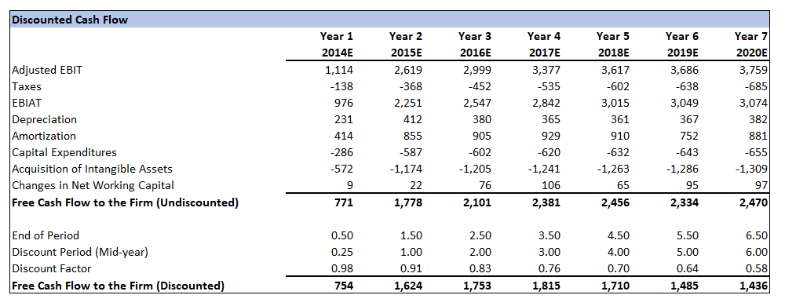

> **Dissertation Title: An Extensive Study of Dell's LBO from Investors
> Perspective**

**Master title: MSc Finance and Investments**

**Name: Arun Akash Jawahar**

> **Year: 2022**

<table border="0" cellpadding="0" cellspacing="0" width="970" style="">
  <thead>
    <tr height="21" style="height: 16pt;">
      <th>Document Name</th>
      <th>Document Description</th>
      <th>Reference Link</th>
    </tr>
  </thead><colgroup><col width="185" style="width: 139pt;"><col width="429" style="width: 322pt;"><col width="356" style="width: 267pt;"></colgroup>
  <tbody>
    <tr height="21" style="height: 16pt;">
      <td height="21" class="xl65" style="padding-top: 1px; padding-right: 1px; padding-left: 1px; color: black; font-size: 12pt; font-family: Calibri, sans-serif; vertical-align: bottom; border-top: none; border-right: 0.5pt solid windowtext; border-bottom: 0.5pt solid windowtext; border-left: 0.5pt solid windowtext; border-image: initial; text-wrap: nowrap; height: 16pt;">DELLS LBO.xlsx</td>
      <td class="xl65" style="padding-top: 1px; padding-right: 1px; padding-left: 1px; color: black; font-size: 12pt; font-family: Calibri, sans-serif; vertical-align: bottom; border-top: none; border-right: 0.5pt solid windowtext; border-bottom: 0.5pt solid windowtext; border-left: none; border-image: initial; text-wrap: nowrap;">
This dissertation examines Dell's successful LBO from an investor's perspective, focusing on the return on investment (ROR) and settlement outcomes for equity investors. Through a detailed LBO model and analysis of different holding periods, it assesses whether the returns met investor expectations and evaluates the overall success of the deal.
</td>
      <td class="xl65" style="padding-top: 1px; padding-right: 1px; padding-left: 1px; color: black; font-size: 12pt; font-family: Calibri, sans-serif; vertical-align: bottom; border-top: none; border-right: 0.5pt solid windowtext; border-bottom: 0.5pt solid windowtext; border-left: none; border-image: initial; text-wrap: nowrap;"></td>
    </tr>
  </tbody>
</table>
1.  **ABSTRACT**

We all are aware that Dell's LBO is one of the successful LBO of all
time, The main objective of this dissertation is viewing the whole LBO
from an investors eye. Dell is initially financed by equity and debt
investors during the LBO the investors were settled so my analyse is
going to be making a rough LBO model to find out how this whole process
is carried out successfully and whether the settlements made to
investors were good and the ROR received by the investors on the whole
deal. I will be doing a detailed analysis on the ROR received by the
equity investors with respect to different holding periods. For making
the LBO model I will be making a detailed company and economic analysis
then with the findings I will making the conclusion with respect to
different IRR expectations and the actual ROR received by the investors.

**TABLE OF CONTENT**

  -------------------------------------------------------------------------------------------------
  **[S.NO]{.underline}**   **[PARTICULARS]{.underline}**                            **[Page
                                                                             Number]{.underline}**
  ------------------------ ------------------------------------------------ -----------------------
  **1**                    **Abstract**                                              **2**

  **2**                    **Acknowledgements**                                      **7**

  **3**                    **Introduction**                                         **10**

  **4**                    **Literature Review**                            

  4.1                      A Brief History of Evolution                               13

  4.2                      Dell's Business Model                                      13

  4.3                      Techniques Prior to the LBO                                13

  4.4                      \`The LBO Phenomenon                                       14

  4.5                      Factors Why Business Choose LBOs                           15

  4.6                      Considerations for Going Private                           15

  4.7                      Dell's Opportunities and Challenges in Public              16
                           Market                                           

  4.8                      Finance and structure of the Deal                          18

  4.9                      Pricing and Valuation                                      19

  4.10                     Pricing Strategies and Contractual Agreements              19

  4.11                     Shareholder's Approval                                     20

  4.12                     Operational Modifications                                  20

  4.13                     Financial Performances                                     23

  4.14                     Effect on Rivals                                           24

  4.15                     Industry and market Consequences                           27

  4.16                     Analyzing Dell's LBO success                     

  4.16.1                   Success Elements                                           30

  4.16.2                   Challenges Faced                                           32

  4.16.3                   Takeaways for other Business taking the same               33
                           Actions                                          

  **4**                    **Methodologies**                                

  5.1                      Data Mining                                                35

  5.2                      Data Gathering                                             35

  5.3                      Steps in an LBO                                            36

  5.4                      Dell's Operating Scenarios                                 37

  5.5                      Transaction Assumptions                                    37

  **6**                    **Findings- Analysis and Discussions**           

  6.1                      Income Statement Projections                               44

  6.2                      Balance Sheet Projections                                  45

  6.3                      Cash Flow Projections                                      48

  6.4                      Sources of Funds                                           51

  6.5                      Uses of Funds                                              54

  6.6                      Debt Funding                                               56

  6.7                      Rollover Equity                                            57

  6.8                      Debt Repayment                                             58

  6.9                      Depreciation and Amortization                              61

  6.10                     Premium to unaffected Share Price                          63

  6.11                     Purchase Price                                             64

  6.12                     Discounted Cash Flow Calculation                 

  6.12.1                   WACC Calculation                                           66

  6.12.2                   Implied Share Price                                        67

  6.13                     Return Analysis                                            68

  6.14                     ROR for Different Time Period                              70

  **7**                    **Conclusion**                                           **73**

  **8**                    **References**                                           **74**
  -------------------------------------------------------------------------------------------------

**TABLE OF FIGURE**

  ------------------------------------------------------------------------------------------
         **[FIG        **[PARTICULARS]{.underline}**                         **[Page
   NO:]{.underline}**                                                 Number]{.underline}**
  -------------------- --------------------------------------------- -----------------------
           1           Income Statement Assumptions                            39

           2           Balance Sheet Assumptions                               40

           3           Cash Flow Assumptions                                   42

           4           Income Statement Projections                            44

          4.1          Income Statement Projections Comparison Chart           45

           5           Balance Sheet Projections                               47

          5.1          Balance Sheet Projections Comparison Chart              48

           6           Cash Flow Projections                                   49

          6.1          Cash Flow Projections Comparison Chart                  50

           7           Sources of Funds                                        51

          7.1          Sources of Funds Chart                                  52

           8           Uses of Funds                                           55

          8.1          Uses of Funds Chart                                     55

           9           Rollover Equity                                         57

           10          Debt Schedule                                           58

           11          Long Term Debt                                          58

           12          Term B Loan                                             59

           13          Term C Loan                                             59

           14          Euro Term Loan                                          60

           15          First Lien Notes                                        60

           16          Microsoft Subordinate Notes                             60

           17          D&A Capital expenditure                                 61

           18          D&A Intangible Assets                                   62

           19          Premium to unaffected Share Price                       64

           20          Purchase Price                                          65

           21          WACC                                                    67

           22          DCF                                                     67

           23          Implied Share Price                                     68

           24          Equity Flows                                            69

           25          Implied Equity Value                                    69

           26          Returns                                                 69

          26.1         Returns Chart                                           69

           27          ROR for different time period                           70

          27.1         ROR for different time period Chart                     71
  ------------------------------------------------------------------------------------------

2.  **ACKNOWLEDGEMENTS**

Having graduated from the Berlin School of Business and Innovation with
a degree in Finance and Investments, my goal is to work in an area where
I can use my expertise most effectively. I became interested in M&A and
investment banking because of the Stock Markets. My desire to work in
investment banking is piqued due to Trading. My Job as a Financial
Associate at Centative Technologies furthered my interest in this area.
Developing a valuation model (Discounted Cash Flow model and Public
Trading Comparable Analysis) for Investment suggestions during my
masters are one of my hardest assignments. Doing this case study is
an effective approach for me to strengthen and advance my financial and
accounting skills, as investment banking demands a very strong
background and expertise in these areas.

I started working on this Honors Thesis titled: "An Extensive Study of
Dell\'s LBO from Investors perspective" as my final semester
Dissertation of 2024 under the guidance of Professor Konstantina
Ragazou. I managed to build a financial model of the LBO's deal between
Dell and Silver Lake thanks to the help of my Professors in BSBI during
my Masters in finance and Investments course. I also followed the
specific and detailed instructions from the Financial Modelling and LBO
Modelling Course by "365 Financial Analyst", which was the core to my
success in building and understanding this model.

> **Statement of compliance with academic ethics and the avoidance of
> plagiarism**
>
> I honestly declare that this dissertation is entirely my own work and
> none of its part has been copied from printed or electronic sources,
> translated from foreign sources and reproduced from essays of other
> researchers or students. Wherever I have been based on ideas or other
> people texts I clearly declare it through the good use of references
> following academic ethics.
>
> (In the case that is proved that part of the essay does not constitute
> an original work, but a copy of an already published essay or from
> another source, the student will be expelled permanently from the
> postgraduate program).
>
> **Name and Surname (Capital letters):**

ARUN AKASH JAWAHAR

> \...\...\...\...\...\...\...\...\...\...\...\...\...\...\...\...\...\...\...\...\...\...\...\...\...\...\...\...\...\...\...\...\...\...\...\...\...\...\...\...\...\...\...\...\...
> Date: 05 / 02 / 2024

**DISSERTATION THESIS**

3.  **INTRODUCTION**

Michael Dell established Dell in 1984 to provide people with directly
customised personal computers. With Dell\'s direct-to-consumer sales
model, clients may customise and buy their PCs directly from the
company, marking a substantial change from the traditional retail
method. The Headquarter is located at round rock, Texas. Dell is a
popular company offering a variety of products such as servers,
desktops, laptops, networking equipment, storage devices, and
peripherals. The company provides a wide range of solutions for large
corporations, small and medium-sized enterprises, and consumers. Over
the years, Dell has made several adjustments to its organisational
structure. Through a large leveraged acquisition, Michael Dell and
Silver Lake Partners took the business private in 2013.

Through a convoluted financial deal involving tracking the stock of its
subsidiary, VMware, Dell went public once more in 2018.To increase the
range of products and services it offers, Dell has made
several acquisitions. Among the noteworthy purchases is the 2016
acquisition of EMC Corporation, a significant participant in enterprise
data management and storage.

One of Dell\'s major subsidiaries is VMware, a pioneer in virtualisation
& cloud infrastructure technologies.

Jim Davidson, Glenn Hutchins, Dave Roux, and Roger McNamee launched
Silver Lake in 1999 headquartered at Menlo Park, California, USA. The
company has grown to be one of the top private equity firms that invests
in the technology industry. Silver Lake has made numerous well-known
investments over the years. Notable investments include joint ventures
with businesses such as Alibaba Group, Dell Technologies, and Skype. The
company frequently adopts a cooperative strategy, closely collaborating
with its portfolio businesses to offer operational know-how and
strategic direction.

Due to the Financial crisis of 2007/2008 the large buyout trends were on
pause. Thus, one of the most notable agreements of the present is the
\$24 billion leveraged buyout (LBO) between Dell and Silver Lake. The
acquisition, whose estimated total value was \$24.9 billion, was finally
finalised on October 29, 2013, after it was first disclosed on February
5, 2013.

The main aim of this dissertation was to do an extensive study on this
LBO model and why the deal was then brought to the court. My plan is to
make a rough LBO model with considering the data and economic factors at
that period of time and compare it with the Dell's model to find out the
disturbing factors which cause the deal to legal problems. Then I am
going to analyse the ROR of the investors for their investments
respective of the holding periods.

There will be 5 main parts in building this model:

1.  Data Mining, Model Setup and Capital Structure.

2.  Creating different Expenses and Revenue scenarios.

3.  Debt schedule creation and LBO model.

4.  Calculating Returns and Conclusion of deal.

5.  Creating different scenarios for ROR.

In findings and analysis \"Transaction Assumptions,\" \"Debt
Assumptions,\" \"Sources and Uses,\" \"Ownership Percentages,\" and
\"Goodwill Creation and Purchase Price Allocation\" will be developed,
along with trend analysis and previous financial statements. The company
paperwork, investor pitches, earnings call records, industry reports and
information from sources like IDC, the proxy statement, merger
agreement, 8-K filings alongside filings from the various parties
involved, annual 10-K along with quarterly 10-Q filings will all need to
be combed through to obtain the required data. It will be necessary to
make assumptions on the principal payback terms, interest rates, and
capital structure.

In section 4 multiple scenarios will be made. There will be three
possibilities presented: the Street consensus, the upside, the downside,
and the base. Revenue forecasts will be made on a
segment-by-segment basis, with the hope that no less than one of the
possibilities will closely resemble the opinions of Wall Street
analysts.

I\'ll tie the required repayments to the initial estimates I made and
the annual cash flow the business generates in section 4. I will cover
all scenarios in my method, including those wherein revolver borrowing
is required, those where revolver financing is not required, and those
where the full debt total is paid off early. Optional payments will be
carried out in the capital structure\'s order of loan seniority. My
initial assumptions will serve as the basis for the interest expense
calculation, which will flow straight into the Income Statement and
create a circular reference.

I will make sensitivity tables based on examples I will continue to
explore and compute the Internal Rate of Return (IRR) for investors, in
this case, Silver Lake Partners. At the end, a synopsis and conclusion
of the agreement will be provided, along with advice on whether or not
to proceed with it. I will be making different assumptions and scenarios
respective with the expected IRR of investors with the received ROR of
investors with respect to different holding period.

4.  **LITERATURE REVIEW**

<!-- -->

3.  

4.  1.  **A Brief History of Evolution:**

Michael Dell created Dell Inc., a global technology business, in 1984.
When the company began operations, it was known as PC\'s Limited, and
Michael Dell sold computers that were compatible with IBM and were built
using stock parts. Dell took a novel approach at the time by selling
directly to customers instead of through conventional retail channels,
enabling order tailoring.

After rebranding as Dell Computer Corporation in 1988, the business grew
to become one of the biggest PC producers in the world by the early
1990s. Dell was able to offer affordable prices and establish an image
for quality and customer service by using a direct-to-consumer business
model. Dell increased the range of products it offered from personal
computers to servers, storage units, networking gear, and other IT
services as the technology sector developed. The organization rose to
prominence in the business community by providing solutions to companies
of all kinds.

2.  **Dell\'s Business Model:**

The company\'s direct business approach, which removed middlemen and let
customers configure their PCs, was mainly responsible for its success.
Dell was able to react swiftly to shifts in market demand because to
this model, which also reduced inventory expenses. Strong relations with
customers were also aided by direct sales, which generated valuable
feedback for bettering the product. Dell pioneered the build-to-order
strategy, which allowed the business to run substantially lower overhead
costs than its rivals and eliminated the necessity for maintaining vital
stock. Dell\'s profitability and competitiveness were aided by its
efficiency.

3.  **Techniques Prior to the LBO**:

As the technology landscape changed quickly over time, Dell was faced
with issues like increased rivalry, shifting consumer tastes, and the
proliferation of mobile devices. In an effort to adjust, Dell increased
the range of goods and services it offered and made acquisitions, such
as the 2009 acquisition of Perot Systems, to bolster its position in the
services industry.

In order to take Dell Inc. private, Michael Dell and the private equity
firm Silver Lake suggested a leveraged buyout (LBO) in 2013. The desire
to embark on major strategic initiatives free from the demands of public
shareholders\' quarterly earnings expectations drove the choice. At
roughly \$24.9 billion, the LBO was finished in October 2013, making it
one of the biggest technology acquisitions in history.

By going private, Dell was able to reorganize the business, allocate
funds to R&D, and concentrate on long-term goals without being subject
to the scrutiny of the public markets. The business kept changing what
it offered, putting more of an emphasis on cloud computing,
cybersecurity, and enterprise solutions.

Through a convoluted financial deal incorporating the monitoring of
stock for its affiliate, VMware, Dell made a comeback to the public
market in 2018. With this change, Dell was able to strengthen its
financial situation and streamline its corporate structure. At present,
Dell Technologies is a multifaceted technology business that provides a
wide range of goods and services, such as servers, PCs, virtualization,
cloud computing, storage, and cybersecurity solutions.

4.  **The LBO Phenomenon:**

An Overview and Historical Background a Leveraged Buyout (LBO) is a
finance manoeuvre in which a business is bought out with a sizable loan,
frequently with the company\'s assets serving as security for the debt.
Leveraging the assets of the target company, the company that is being
acquired (or a group of financiers) usually borrows a significant
portion of the cost of the purchase to finance the deal. Historically,
the 1980s saw a rise in the popularity of LBOs, which frequently refers
to this period of corporate acquisitions and restructuring. One of the
most well-known LBOs during this time was the 1988 purchase of RJR
Nabisco,

which is renowned as being chronicled in the publication \"Barbarians at
the Gate.\"

5.  **Factors Why Business Choose LBOS:**

Leveraged buyouts are sought out by businesses due to many factors:

-   **Organizational Restructuring:**

Businesses may choose to strategically reorganize their operations with
leveraged buyouts (LBOs), which offer more independence and
effectiveness without the limitations of public ownership.

-   **Undervaluation:**

Companies occasionally think that the public markets have undervalued
their shares. By going private via an LBO, they may be able to gain from
a rise in value without having to deal with the scrutiny of other
shareholders.

-   **Long-Term Planning:**

Companies that have private ownership are free from the short-term
constraints of quarterly revenue expectations to concentrate on their
long-term objectives. For strategic efforts and investments that can
take some time to pay off, this might be quite important.

-   **Decrease of Public Scrutiny:**

A company\'s decision-making authority can be heightened as it goes
private since it will be protected from activist investors and the
public eye.

-   **Operational Improvements:**

Through the infusion of private funds into an LBO, one can fund R&D,
take on projects that might be difficult to conduct in the public
market, and improve operations.

The potential to make major operational changes free from the urgent
pressures of public markets, long-term planning goals, and strategic
flexibility all played a role in Dell\'s LBO.

1.  **Considerations for Going Private:**

-   **Evaluation of Dell\'s Choice:**

Several important factors affected Dell\'s 2013 Leveraged Buyout (LBO)
decision to go private:

-   **Strategic Flexibility:**

Dell\'s strategic flexibility was increased by the choice to go private.
Being a business that is privately owned allowed it to make choices and
carry out long-term plans free from the immediate pressure of achieving
quarterly profit targets. This was especially significant in the quickly
changing technology sector, where adaptability and long-term planning
were essential.

-   **Long-Term Vision:**

With its ownership now private, Dell will be able to concentrate on its
long-term goals without having to adjust to the demands of the market.
This was essential for the business to manage the change in the sector
as well as invest investing in projects that could fail to pay out
immediately.

-   **Operational Modifications:**

Without the limitations of open markets, Dell was able to implement
considerable operational modifications thanks to the leverage buyout.
This included undertaking investments in R&D, restructuring the company,
and embarking on projects that would have encountered opposition or
mistrust from public shareholders.

-   **Undervaluation Concerns:**

According to Michael Dell and Silver Lake, his private equity partner,
the public market did not fully recognize Dell\'s potential. The
decision to go private gave the company\'s executives the opportunity to
possibly profit from any increases in value that might come from
restructuring and strategic initiatives.

1.  **An Examination of DELL\'S Opportunities and Challenges in the
    Public Market:**

**Challenges:**

-   **Short-Term Pressures:**

Intense short-term pressure to achieve quarterly earnings expectations
is frequently placed on publicly traded corporations. Long-term
objectives and investments may be hindered by this.

-   **Activist Investors:**

Investors that advocate for modifications to administration, strategy,
or capital allocation may target publicly traded corporations. Even as a
popular IT firm, Dell was subject to such a variety of expectations.

-   **Market Expectations:**

Stock prices are influenced by market expectations, which can move the
public markets quickly in response to news and events. It could be
difficult for a firm like Dell to manage these expectations while going
through strategic changes.

**Prospects:**

-   **Funds Access:**

Through stock offerings, public companies are able to raise money with
less difficulty. Dell did, however, choose to go private by leveraging
debt, which gave the business significant capital without hurting
existing owners.

-   **Exposure and Brand Image:**

Having a public listing increases a company\'s visibility and boosts its
credibility. Increased analyst service, exposure, and the capacity to
draw in a wider pool of investors can often be beneficial for public
companies.

-   **Shareholder Liquidity:**

Shareholders can quickly buy and sell shares thanks to the liquidity
offered by public markets. Going private reduces this liquidity, that
might cause a consequence on certain investors\' capacity to sell their
holdings.

To put it briefly, the desire for strategic flexibility, independence
from short-term demands, and the capacity to carry out long-term
objectives without constant public scrutiny were the driving forces
behind Dell\'s decision to go private. While there are benefits to being
a public company, Dell\'s leadership felt that turning private would
enable the company to better focus on its transition and navigate the
ever-changing technology landscape.

1.  **Finance and Structure of the Deal:**

The Leveraged Buyout (LBO) of Dell, spearheaded by founder Michael Dell
and the investment firm Silver Lake Partners, was a calculated decision
to take the company private. A combination of debt financing, private
equity, and other instruments were used in the financial arrangements.

I.  **Private Equity Companies:**

-   **Silver Lake Partners:**

A key participant, Silver Lake supplied the knowledge and funding
required for the LBO. Typically, private equity firms such as Silver
Lake aim to increase the value of their assets by active management and
strategic decision-making within the acquired company.

II. **Debt Management:**

-   **Leverage:**

In an LBO, the word \"leveraged\" denotes a significant reliance on
borrowed money. In order to finance the acquisition, Dell obtained a
substantial quantity of debt, frequently pledging the acquired
company\'s assets as security.

-   **Bank Loans:**

In order to finance the acquisition, Dell secured loans from a number of
financial institutions. This was typical of LBOs in that the company\'s
assets served as collateral for these loans.

-   **Bond Issuance:**

Dell issued bonds, characterized as financial assets with a repayment
commitment, in order to raise additional funds. The total cost of
borrowing climbed as a result of these bonds\' interest payments.

III. **Equity Investment:**

-   **The contribution of Michael Dell:**

As the company\'s creator and CEO, Michael Dell made a sizeable personal
investment to show that he was committed to the business\'s success
under its fresh private ownership structure. Contribution from Private
Equity: The transaction involved equity capital given by Silver Lake and
additional private equity investors. This equity part helped to balance
the financial structure and lower the total indebtedness.

-   **Share Buyback:**

Dell bought back its outstanding shares from shareholders that were open
to the public as a major component of the LBO. Dell became a privately
owned company following enduring this process after being removed from
the stock exchange.

1.  **Pricing and Valuation:**

**Techniques for Dell Valuation During the LBO Process:**

-   **Comparable Company Analysis (CCA):**

This technique compares the valuation multiples and financial metrics of
Dell with those of comparable publicly traded firms. The study offered a
standard by which to measure Dell\'s worth.

-   **Discounted Cash Flow (DCF) Analysis:**

DCF calculated the present value of Dell\'s anticipated future cash
flows. This approach produced an intrinsic valuation and took the time
worth of money into consideration.

-   **Leveraged Buyout (LBO) Model:**

Assuming that debt would be the main form of financing for the
acquisition, the LBO model concentrated on possible returns for
investors. It took into consideration factors like equity returns, loan
repayment, and exit multiples. \\

1.  **Pricing Strategies and Contractual Agreements:**

-   **Special Offer:**

Michael Dell and Silver Lake paid more for Dell\'s shares than the going
rate in order to entice stockholders. The possible future value
anticipated by going private was reflected in this premium.

-   **Discussions with stockholders:**

In order to get existing shareholders---both institutional and
individual---to agree to sell their shares at the premium being offered,
negotiations were necessary.

-   **Fairness Viewpoint:**

To guarantee that the offered price was reasonable from a financial
standpoint, a fairness judgment was probably given by an impartial
financial expert. It is normal to take this action to safeguard
shareholders\' interests.

-   **Go-Shop Supply:**

A \"go-shop\" clause in certain LBOs permits the target firm to
aggressively look for other purchasers for an agreed-upon period of
time. This guarantees that shareholders will be able to evaluate
competing bids.

1.  **Shareholder Approval:**

> A sizable majority of shareholders required approval of the deal for
> it to be finalized. Getting the required number of shareholder votes
> was essential for success. To put it briefly, Dell\'s leveraged buyout
> (LBO) was a complex financing arrangement which involved debt finance,
> private equity, and strategic choices to move the firm from publicly
> to private ownership. The techniques of valuation were thorough,
> considering into account intrinsic elements as well as industry
> benchmarks. Carefully planned negotiations and pricing strategies were
> used to guarantee approval by shareholders and the LBO\'s successful
> completion.

2.  **Operational Modifications:**

**Analysis of Post-LBO Changes to Dell's Business Operations:**

> Significant operational changes resulted from Dell\'s 2013 Leveraged
> Buyout (LBO), which turned the publicly traded firm into a private
> enterprise. Dell was able to make strategic choices with greater
> freedom as a private corporation since it was not subject to the
> immediate demands of the public markets.

The following are the main areas in which noted operational changes:

i.  **Strategic Emphasis on Business Solutions**

-   **Diversification of Offerings:**

In order to become a complete solutions provider, Dell moved its
emphasis from traditional personal PCs. The business placed more of an
emphasis on business solutions, which comprised networking, servers,
storage, and IT services.

-   **Acquisitions to Expand:**

In order to diversify its holdings after the LBO, Dell made a number of
wise acquisitions. EMC Corporation was one of Dell\'s notable
acquisitions in 2016, establishing the company as a prominent
participant in the storage and data management space.

-   **Research and development expenditures:**

Higher R&D Spending: Dell was able to dedicate bigger investments in R&D
because it was a private company. Without the immediate need to satisfy
expectations for quarterly earnings, the corporation could devote
resources to innovation.

-   **Emphasis on Emerging technology:**

Cloud computing, cybersecurity, and artificial intelligence are a few
examples of emerging technology that Dell focused on. The purpose of
this strategic modification was to maintain Dell\'s dominance in new
technological developments.

ii. **Efficiency in Operations and Cost Control:**

-   **Streamlining Operations:**

Dell takes steps to improve the effectiveness of its operations. The
company has organized, simplified processes to cut expenses and boost
flexibility.

-   **Flexibility in Decision-Making:**

Being a privately held business, Dell was able to make strategic choices
free from the restrictions placed on it by open marketplaces. This
adaptability enabled prompt reactions to shifts in the market and in
decision making.

-   **Customer-First Strategy**:

Personalization and Customer Support: After the LBO, Dell\'s
direct-to-customer business strategy was strengthened. The business
persisted in emphasizing product customization, permitting customers to
personalize solutions to meet their unique requirements. One of the main
focuses of Dell\'s operations continued to be customer service.

-   **Long-term ties:**

Dell could cultivate enduring ties with its clients without being unduly
impacted by the needs imposed by the short-term market. This strategy
helped to foster loyalty and trust among its consumers.

-   **Cultural Transitions and Staff Involvement:**

Cultural Shift: Innovation, teamwork, and strategic thinking gained
greater significance at Dell following a cultural shift. The goal of
this change was to bring the company\'s culture into line with its
strategic goals.

-   **Employee Empowerment:**

Being a privately held company, Dell was able to offer employees with
opportunity to express themselves and take calculated risks. Employee
engagement and satisfaction started to take precedence.

iii. **Reaction to the Dynamics of the Market:**

-   **Agile Reaction to Trends**:

Dell was able to react to changes in the market and in customer
expectations with more speed thanks to the flexibility provided by
private ownership. The business could make quick adjustments to its plan
without requiring extensive justifications or approvals.

-   **Initiatives for Digital Transformation**:

Dell adopted digital transformation for its internal procedures and for
its products. The business made a decision to invest in digital
technologies to expand its capabilities and boost productivity.

In conclusion, major operational changes were made possible by Dell\'s
LBO, which turned the business from a publicly traded one to a private
entity. Essential elements of Dell\'s post-LBO operational strategy
included its increased R&D spending, emphasis on operational efficiency,
strategic focus on business solutions, and cultural transformation. The
business demonstrated the benefits of private ownership in fostering
long-term innovation and value through its flexibility in responding to
changing market conditions and developing technologies.

1.  **Financial Performance:**

> The 2013 Leveraged Buyout (LBO) that turned Dell private had a big
> impact on the business\'s bottom performance. With this choice, Dell
> was able to invest in new areas, alter its business plan, and adjust
> to shifting market conditions. The following is a post-LBO examination
> of Dell\'s financial results involving pre- and post-transaction
> comparisons of important financial metrics:

-   **Growth and Revenue:**

Before to the LBO - Traditional desktop and laptop computers accounted
for a large portion of Dell\'s income.

After the LBO - Dell focused on enterprise solutions, such as servers,
storage, and services, to diversify its sources of income. Dell\'s
capabilities got even better with the purchase of EMC in 2016, which
helped to increase revenue.

-   **Profitability:**

Before to the LBO - Dell challenged with maintaining competitive in the
face of shifting consumer preferences and heightened competition.

After the LBO - Dell\'s transition to higher-margin enterprise solutions
had a positive effect on profitability. Improved margins were a result
of operational efficiency and cost control strategies.

-   **Debt Levels:**

Before LBO - Dell had a relatively low level of debt as a publicly
traded company.

After LBO - The LBO involved a significant increase in debt to finance
the transaction. However, the company\'s ability to service this debt
was influenced by its improved profitability and cash flow.

-   **Cash Flow:**

Before LBO - Dell\'s cash flow was subject to the cyclicality of the PC
market.

After LBO - The shift toward enterprise solutions and the acquisition of
EMC contributed to a more diversified revenue stream and improved cash
flow generation.

-   **Stock Performance:**

Before LBO - Dell\'s stock performance was influenced by market
expectations, and the stock faced challenges amid industry changes.

After LBO -Being a private company, Dell\'s stock performance was no
longer subject to public market volatility. Dell returned to the public
market in 2018 through a tracking stock for its subsidiary VMware,
simplifying its corporate structure.

-   **Return on Investment (ROI):**

Before LBO - Shareholders faced challenges in realizing returns as
Dell\'s stock struggled.

After LBO - The success of the LBO was contingent on the company\'s
ability to deliver returns to private equity investors. The subsequent
strategic initiatives, including the EMC acquisition, were aimed at
enhancing long-term value.

-   **Strategic Investments:**

Before LBO - Dell faced constraints in making significant strategic
investments due to public market scrutiny.

After LBO - Dell\'s financial flexibility as a private company enabled
strategic investments in research and development, acquisitions, and
digital transformation initiatives.

-   **Long-Term Debt Structure:**

Before LBO - Dell had a relatively clean balance sheet with limited
long-term debt.

After LBO - The LBO led to an increase in long-term debt. However, the
company\'s ability to manage and service this debt was contingent on its
operational performance and profitability.

1.  **Effect on Rivals:**

The 2013 leveraged buyout (LBO) of Dell had a significant impact on
rivals in the technology sector. Dell was able to realign its strategy,
concentrate on corporate solutions, and embark on long-term investments
after deciding to go private. An examination of the effect on rivals and
the ensuing competitive dynamics in the market is provided below: Effect
on Rivals: Dell\'s LBO\'s Effect on Rivals in the Technology Sector.

The 2013 leveraged buyout (LBO) of Dell had a significant impact on
rivals in the technology sector. Dell was able to realign its strategy,
concentrate on corporate solutions, and embark on long-term investments
after deciding to go private. An examination of the effect on rivals and
the ensuing competitive dynamics in the market is provided below:

I.  **Pay attention to enterprise solutions:**

**Effect on Rivals:**

Dell\'s increased emphasis on business services and solutions presented
a problem for rivals in the technology industry. Businesses in the same
industry had to adjust to the shifting competitive environment while
Dell worked to solidify its position as a provider of complete
solutions.

**Reactions:**

In order to remain competitive with Dell\'s expanding offerings,
competitors were forced to reevaluate their own portfolios and tactics.
In order to improve enterprise solution capabilities, this frequently
required strategic alliances, acquisitions, or internal development
initiatives.

II. **Vertical Integration and Diversification:**

**Effect on Rivals:**

Strategic shifts toward vertical integration and diversification had
been rendered feasible by Dell\'s leveraged buyout. In order to stay
competitive, rivals had to assess their individual portfolios and decide
whether to expand their product offers or undergo vertical integration.

**Reactions:**

Rivals investigated vertical integration and diversification prospects
in response. This could entail collaborations, acquisitions, or internal
growth initiatives to fortify their positions in important market
niches.

III. **Customer-centric methods and operational efficiency:**

**Effect on Rivals:**

Rivals reassessed their own operational models and customer interaction
methods in response to Dell\'s emphasis on efficiency in operations and
upholding a client-centric strategy.

**Reactions:**

Rivals aimed to boost customer satisfaction and operational
effectiveness. To maintain competitiveness, this might include adopting
direct-to-customer business approaches, putting resources into excellent
client service, or optimizing processes.

IV. **Digital transformation and innovation:**

**Effect on Rivals:**

Dell\'s emphasis on invention and digital transformation following its
LBO established a standard for rivals. In order to remain relevant, the
sector saw a shift toward embracing innovative technologies.

**Responses:**

Competitors comprised scaling up investment in research and development,
looking into joint ventures with tech startups, and quickening their
individual digital transformation projects. In order to keep up with
Dell\'s dedication to remaining at the leading edge of technical
breakthroughs, this was imperative.

V.  **Purchases with a strategic intent:**

**Effect on Rivals:**

Dell\'s 2016 purchasing of EMC Corporation greatly improved its data
management and storage capabilities. Rivals had to evaluate how such
types of strategic acquisitions would affect the dynamics of the market
and their unique competitive advantages.

**Response:**

Competitors were thinking about forging their own calculated
collaborations or acquisitions to improve their market positions. This
can entail forming strategic relationships to increase the range of
products offered or buying businesses with similar technologies.

VI. **Investor Expectations and Market Perception:**

**Impact on Rivals:**

Investor expectations and market perceptions were affected by Dell\'s
move from public to exclusive ownership. It was expected of competitors
to show that they could adapt to changes in the market and yet meet
investor demands.

**Reactions:**

Rivals made an effort to convince investors and the market of their
strategic goals. To conform to market expectations, they may introduce
modifications to financial reporting, corporate governance, or strategic
communication.

VII. **Reaction to Dell\'s Re-Entry into the Public Domain:**

**Effect on Rivals**:

In 2018, Dell made a comeback to the public markets by way of a tracking
stock for VMware, thus made things worse the competitive environment.
Rivals had to evaluate how this action would affect Dell\'s strategic
positioning.

**Reactions:**

Rivals kept a close eye on Dell\'s re-entry into the public markets and
modified their plans appropriately. To maintain their flexibility in
reacting to changing circumstances, they may assess the effect on
investor views and market dynamics.

To sum up, the IT industry\'s competitive dynamics were altered by
Dell\'s leveraged buyout. Dell\'s increased emphasis on enterprise
solutions, operational alterations, and strategic modifications forced
rivals to adjust. In response to Dell\'s transformation, competitors in
the industry placed greater focus on innovation, diversity, and
customer-centric approaches in an effort to stay competitive in a market
that was changing quickly.

1.  **Industry and Market Consequences:**

**General Market Patterns Affected by DELL'S LBO:**

> The 2013 leveraged buyout (LBO) of Dell had a significant impact on
> the company as well as larger market trends in the corporate finance
> and technology industries. The revolutionary quality of Dell\'s LBO
> shaped a number of market trends and provided a benchmark for
> companies that were to consider pursuing equivalent strategies. This
> report analyses at the general market trends that Dell\'s LBO has
> affected and what it implies for other businesses:

I.  **Trends in LBO and Private Equity:**

> **Impact:**
>
> The successful benefited purchase of Dell illustrated how private
> equity firms may stimulate strategic changes within major technology
> corporations. It demonstrated how skilfully handled LBOs might give
> businesses the flexibility they need to innovate and adjust to
> shifting market conditions.

**Consequences:**

> Dell\'s LBO was observed by other technology companies as an
> achievable strategy towards revolutionary transformation. Due in part
> to Dell\'s triumphant leverage the acquisition, other companies began
> to experiment with similar tactics, collaborating with private equity
> companies to restructure their operations.

II. **Pay attention to enterprise solutions:**

**Impact:**

> The strategic transition of Dell towards enterprise solutions
> following the LBO had an impact on wider market trends. The sector saw
> a shift in emphasis from traditional hardware to completely
> comprehensive company offerings and services.

**Consequences:**

> Other tech firms took note of Dell\'s ability to change with the times
> and diversify its possible sources generating revenues. This had an
> impact on a larger trend in which businesses tried to improve their
> enterprise solution skills in order to stay competitive in a changing
> market.

III. **Long-Term Planning and Operational Efficiency:**

**Impact:**

> As a privately held firm, Dell established a standard for other
> businesses by emphasizing operational effectiveness and long-term
> planning. It became clear that flexibility, innovation, and a break
> from transient market pressures were important.

**Consequences:**

> Businesses across a range of sectors, not only technology, began
> looking into ways to improve operational effectiveness and promote
> long-term thinking. The triumph of Dell\'s leveraged buyout has led to
> a wider recognition that strategic choices ought to be in line with
> long-term objectives instead of spurring on short-term market
> responses.

IV. **Intentional Purchases to Increase Diversification:**

**Influence:**

> The significance of strategic acquisitions for market expansion and
> diversification was brought to light by Dell\'s acquisition of EMC
> Corporation. The action demonstrated how acquisitions might place
> businesses as leaders in emerging and expanding market niches, which
> had an impact on market trends.

**Implications:**

> In order to diversify their holdings and obtain a competitive
> advantage, businesses in a variety of sectors began investigating
> strategic acquisitions. Successful post-acquisition synergies were
> modelled after Dell\'s integration with EMC.

V.  **Innovation in Technology and Digital Transformation:**

**Impact:**

> Wider market trends were impacted by Dell\'s dedication to
> technological innovation and digital transformation. The sector
> realized that in order to remain relevant and competitive, it was
> necessary to adopt developing technologies.

**Consequences:**

> Businesses across a range of industries, including technology, began
> to place a higher priority on R&D, digital transformation, including
> the implementation of new technologies. Companies looking to take the
> lead in this age of rapid innovation in technology could take
> something about Dell\'s story.

VI. **Going Back to Open Markets:**

**Impact:**

> Dell\'s entry back into the public markets with a tracking share for
> VMware was a distinctive move. The action changed how the market saw
> the company and showed that corporations could consciously transition
> between private and public ownership arrangements.

**Consequences:**

> Other businesses saw Dell\'s re-entry into the public markets as a
> possible tactic to maximize investor value. The relocation triggered
> debate about the benefits and difficulties of such changes.

VII. **Strategic Disclosure and Communication:**

**Impact:**

> The experience of Dell brought to light the significance of
> transparent and strategic communication, particularly in the midst of
> major company transformations.

**Consequences:**

> Businesses recognized that during strategic transitions, companies
> need to interact adequately with stakeholders. A trend where
> businesses tried to proactively convey their long-term ambitions,
> operational improvements, and strategic initiatives had been impacted
> by Dell\'s leveraged buyout.

To sum up, Dell\'s leveraged buyout had a significant impact on the
market by establishing standards for private equity tactics,
organizational changes, calculated acquisitions, and the significance of
technological innovation. Businesses across a range of sectors saw these
trends and adjusted, realizing that in the face of swift industry
change, flexibility, long-term planning, and a focus upon comprehensive
solutions were essential.

1.  **Analysing DELL'S LBO Success:**

<!-- -->

1.  

2.  

3.  

4.  1.  

    2.  

    3.  

    4.  

    5.  

    6.  

    7.  

    8.  

    9.  

    10. 

    11. 

    12. 

    13. 

    14. 

    15. 

    16. 1.  **A Critical evaluation of the Success Elements and
            Difficulties DELL faces after the LBO:**

-   **Strategic Emphasis on Business Solutions:**

**Success:**

> One of the main reasons for Dell\'s success was its transition to
> enterprise solutions, which included the acquisition of EMC. By making
> this change, the business was able to establish itself as a complete
> solutions provider and diversify its sources of income.

**Lesson:**

> Organizations should deliberately match their portfolios with new
> opportunities and rigorously evaluate market changes. Specializing in
> higher-margin markets can help ensure long-term success.

-   **Efficiency in Operations and Cost Control:**

**Success:**

> Increased profitability and agility were a result of Dell\'s focus on
> cost control and operational efficiency. The company was better
> equipped to handle changes in the industry after streamlining
> processes.

**Lesson:**

> In a dynamic market, operational efficiency is critical. Companies can
> improve their competitiveness by continuously assessing and
> streamlining their operations.

-   **Acquisitions and Integrations Strategically:**

**Success:**

> Dell\'s capacity to carry out strategic acquisitions effectively was
> demonstrated by the integration of EMC. The company\'s competencies
> and market reach were increased by this action.

**Lesson:**

> The purchase process requires meticulous planning and execution. For
> companies to maximize value and achieve synergies, post-acquisition
> integration ought to comprise the top elaboration.

IV. **Being adaptable and long-term oriented:**

**Success:**

> The benefits of private ownership were shown by Dell\'s capacity for
> long-term planning and strategic decision-making in the absence of
> short-term market constraints. The company\'s ability to be flexible
> helped it adjust to changing industry conditions.

**Lesson:**

> It\'s important to balance short- and long-term objectives. The
> ability to make strategic choices in line with an enterprise\'s
> long-term goals has the potential to be conferred by private
> ownership.

V.  **Innovation and Digital Transformation:**

**Success:**

> Dell became a leader in new technologies because of its dedication to
> innovation and digital transformation. R&D expenditures helped Dell
> maintain its lead in a sector that was changing quickly.

**Lesson:**

> To stay competitive, businesses should give innovation and digital
> transformation a top priority. It is essential to keep up with the
> latest developments in technology.

1.  **Challenges Faced:**

<!-- -->

I.  **Debt Load and Risk to Finance:**

**Challenge:**

> There are worries about financial risk since Dell\'s LBO has caused a
> large increase in debt. Maintaining steady cash flow and profitability
> was what was required when handling this debt load.

**Lesson:**

> Businesses thinking about LBOs should carefully evaluate their ability
> to pay off debt and stay afloat. To reduce risks, effective debt
> handling is essential.

II. **Expectations of shareholders and market perception:**

**Challenge:**

> Dell faced challenges because of how the market viewed its company\'s
> tactics, especially because it was re-entering the public markets.
> Achieving shareholder expectations necessitated strategic objective
> alignment and transparent communication.

**Lesson:**

> Organizations are in need of to be proactive in managing relations
> with stakeholders, particularly in times of change. It serves as vital
> for communicating openly and honestly in order to match shareholder
> expectations.

III. **The state of competition and disruption in the industry:**

**Challenge:**

> With new entrants and changing market dynamics, the technology
> industry saw fast upheaval. Dell had to make its way through a very
> competitive environment.

**Lesson:**

> Businesses ought to be informed for possible disruptions to their
> sector and constantly adjust to shifting market conditions. A
> competitive edge requires flexibility and the capacity to change
> course when called for.

IV. **Cultural Shift:**

**Challenge:**

> The challenge for Dell\'s culture transform was to convince people in
> the organization to support the corporation\'s fresh mission and
> strategic orientation.

**Lesson:**

> Changes in culture necessitate careful preparation and communication.
> Some companies have to make decisions to support a culture that is in
> line with their strategic goals.

1.  **Takeaways for other Business Contemplating the same Actions:**

-   **Aligning Strategically with Market Trends:**

Businesses should evaluate market movements on a regular basis and
carefully match their portfolios to new prospects. Remaining ahead of
changes in the industry is essential for sustained success.

-   **Operational Agility and Efficiency:**

The ability to navigate changes in the industry requires operational
efficiency and agility. To increase competitiveness, businesses should
continuously optimize their operations.

-   **Careful Planning for Acquisition:**

Although thorough preparation & post-acquisition integration are
essential for success, strategic acquisitions can be effective growth
engines.

-   **Managing Both Short- and Long-Term Objectives:**

It\'s essential for finding a balance between long-term strategic
objectives and short-term market expectations. Making decisions that are
in line with an enterprise\'s long-term goal can be made easier under
private ownership.

-   **Handling Debt Effectively:**

Companies thinking about leveraged buyouts need to evaluate their
ability to properly handle debt. Maintaining a healthy debt management
plan is essential to reducing financial risks.

-   **Effective Communication and Openness:**

It\'s essential to partner actively with stakeholders, particularly
during big changes. Controlling market perceptions is rendered tougher
with transparency and precise definition of strategic objectives.

-   **Counting on Industry Upheavals:**

Businesses should have an adaptable culture and prepare for industry
upheavals. To remain competitive in ever-changing marketplaces, one must
possess agility.

In conclusion, firms contemplating pursuing a similar move can learn a
lot from Dell\'s LBO. Strategic alignment, operational effectiveness,
successful acquisitions, adaptability, and an emphasis on innovation are
examples of success factors. Difficulties like cultural shifts and
financial challenges discuss the significance it is to prepare ahead and
communicate well. The insights gained from Dell\'s experience aid in an
expanded understanding of the opportunities and challenges connected to
big business transitions.

5.  **METHODOLOGIES**

<!-- -->

1.  

2.  

3.  

4.  

5.  1.  **Data mining:**

To gather data, I examined Dell\'s internal researcher presentation to
see how the company thinks about growth in revenue, profitability, and
other factors. My goal was to create a model that would not only match
these estimates precisely but also produce different outcomes rather
than just match their unduly optimistic ones. Among the significant
historical information, I discovered are past bids made to Dell by other
parties. These were Blackstone and Carl Icahn\'s genuine bids. But
Blackstone then withdrew their bid following their original offer. Since
there was only one buyer along with a seller in this instance and no
other bids, these bids were crucial since they supported me later on as
I contributed to the valuation of Dell.

2.  **Data Gathering:**

I visited edgar.sec.gov in search of public filings from publicly traded
firms like Dell. However, I chose to visit Dell\'s corporate website at
www.dell.com and check their shareholder relations section because of
the website\'s complexity and volume of pointless material. This is
where I extracted the most important information and facts from their
SEC filings, 10-K, 10-Q, and downloadable annual reports. I downloaded
the earnings call transcripts and went to the \"Investor Events and
Webcasts\" page to view the investor presentations.

They provided me with a useful insider\'s perspective of how they view
the company\'s future and what they forecast for analyst presentations.
I used this information as a standard to evaluate if our optimistic case
matched the company estimates. Going forward, it is evident from the
bids made by Carl Icahn and the Blackstone Group that some of them are
paying \$14.25 per share as opposed to \$13.65. At first, the Blackstone
plan called for Dell to remain partly publicly traded, with some of its
shares continuing to be listed on the NASDAQ. These details won\'t be
used specifically, but they will come in handy in \"what-if\" scenarios
to offer alternate possibilities when presenting the investment concept.

In addition, I downloaded Each Equity Research Report from \"Thomson
Reuters\" for Dell\'s equity research reports. In this report, I found
Morgan Stanley\'s investment thesis, which included their projections
and the Discounted Cash Flow model. This provided me with valuable
information about Dell\'s historical market share as well as how it has
fluctuated in different markets. This report was also helpful in
comparing my estimates and projections from my Wall Street case research
with other estimates and projections.

The debt schedule presented a significant challenge throughout the
model\'s construction. I was enabled to look at Dell\'s current debt
tranches and made the model more straightforward. I looked at the DEF14A
filing, sometimes referred to as a proxy statement, in search of
specific merger materials. It was in this form that I discovered the
background discussion of this merger. Only the solicitors working on the
deal or the bankers negotiating it will find the information about the
plans, the goal, the covenants and agreements, the terms and conditions
for the merger, and the termination useful. I made substantial use of
the predicted financial data and the funding of the merger part for
modeling purposes. During the processing of the company\'s restricted
stock units and stock options, certain information from certain sections
of the merger\'s agreement proved helpful. The Dell LBO Financing part
was especially important since it provided me with specific information
about the funding source, the various debt tranches, their interest
rates, and the principal repayment periods. That concluded my data
collection process.

3.  **Steps in an LBO:**

<!-- -->

1.  Projected EBITDA and available cash flow for loan repayment
    during the investment, depending on several operating scenarios
    (see Dell Operating Scenarios).

2.  Establish suitable debt arrangements and ratios of leverage that
    yield suitable credit data-based.

3.  Based on a multiple of EBITDA, estimate the exit price; this must be
    close to the entry multiple.

4.  Compute the IRR and make the first three steps more sensitive.

5.  Using your needed rate of return and the previous criteria, solve
    for the entrance price.

    1.  **Dell's Operating Scenarios:**

Five operational scenarios are used by the LBO model, as explained
below, to establish a range of values. These are from a Bank case, an
amended BCG case, and three projections from the Boston Consulting Group
(BCG).

BCG was brought in to aid in the sales process by helping to project
revenue, gross profit, and EBITA, which would later serve as a separate
foundation for value in the framework (Exhibit 4). Three operating cases
BCG Base, BCG 25%, and BCG 75% were restored by BCG.

Though consistent with analyst reports, BCG Base was more negative than
earlier management comments. Dell was projected by BCG\'s studies to
realize between 25% and 75% of the \$3.3 billion in cost reduction
management that was their stated objective.

Following their investigation, BCG concluded that the 25% Case
represented the most realistic set of estimates. To contact banks about
debt financing during the acquisition, Mr. Dell & Silver Lake
constructed an additional \"Bank Case.\" The model, being careful,
presents a fifth example that accounts for 95% of the BCG 25% example
(BCG 25% Adjusted).

2.  **Transaction Assumptions:**

I looked up Dell\'s share price history on Google Finance to get the
\"undisturbed share price\". Since there was an enormous rise in value
between January 11 and January 14, I used the undisturbed price of the
shares of \$10.88, which occurred just before word of the possible LBO
acquisition leaked. Analysts typically examine the pricing of M&A deals
one day in advance or even thirty days in advance, but in this instance,
I chose to go backward as far as I could, to the day before the
takeover became public and people began to speculate about it. The date
in this instance is January 11th, and the share price is \$10.88. The
undisturbed price of a share multiplied by one plus this 25.5% offering
premium is what is used to compute the offer premium, which is expressed
as a percentage and determined backward from the amount that Silver Lake
provided: \$13.65 per share. The transaction did not close on February
1st, 2013, even though it was disclosed at the beginning of the month. A
significant deal like this usually requires six to nine months, and
occasionally longer, to close in real life. Therefore, it might be more
precise to expect that this agreement closes anytime between September
and December 2013 or towards the conclusion of their fiscal year 2014.

But that will lead to a lot of difficulties. After that, I\'ll have a
stub phase, and even if it might be visually appealing, it\'s not
realistic to expect to complete the creation of the model within a short
amount of time.

In the following section, a leverage ratio is typically included in an
LBO model. This implies that if I require \$10 billion for this
transaction and, for example, have a 50% leverage ratio, I will receive
50% of that amount in loans. That comes to a total of \$5.0 billion,
plus an additional \$5.0 billion due to the PE\'s 50% equity. But
Michael Dell was putting some of his own money into his investment funds
technically, his personal family office because he had this Founder
rollover. I may wind up with a negative equity investment for Silver
Lake, depending on his level of commitment. Considering a \$10 billion
transaction, Michael Dell is contributing \$2.0 billion.

If I were to enter an 80% leverage ratio in this cell, I would not
receive proper results. Since an 80% ratio of leverage would be
equivalent to about \$8.0 billion, Silver Lake could essentially make no
contributions and yet complete the deal. Furthermore, things would get
worse if the leverage ratio was 90% since Silver Lake would have to
contribute \$1.0 billion, which is patently absurd. Therefore, basing
the calculation on the real amount of the financing gap would be a
preferable method to arrive at a number. I took a look at the
acquisition price, added any debt that needed to be paid off or
refinanced, deducted any extra cash the business was consuming, and then
calculated Michael Dell\'s cash contribution along with how much he was
rolling over.

{width="7.145833333333333in" height="3.5in"}

> **Fig 1: Income statement assumption**

This in turn informed me of how much I would have to spend across these
various sources, the amount of debt I would have to incur, and how much
equity Silver Lake\'s investment provided when I looked down on the
Sources & Uses schedule. This is the only method to make the model
function, even though it is a little unconventional. The 10-K was the
source of the share counts. I looked across the DEF14A Merging Agreement
and came across the following statement on page 10: "Michael S. Dell,
Chairman and Chief Executive Officer of the Company, and The Susan
Lieberman Dell Separate Property Trust (together with Mr. Dell, the "MD
Investors"), who together have agreed, severally and not jointly, to
transfer, contribute and deliver to Parent, immediately prior to the
consummation of the merger, 273,299,383 shares of the Common Stock".
However, in page 4, it was stated that: "As of May 16, 2013, Mr. Dell
and certain of his related family trusts beneficially owned, in the
aggregate, 274,434,319 shares of Common Stock" In an attempt to make
things simpler, I decided to use 274,434,000 shares. In theory, there
were a couple more alternatives, but for the sake of simplicity, I
haven\'t included them. I began by figuring out the enterprise value,
diluted equity value, and diluted share. I then learned about required
cash. I looked at the Dell Fiscal Year 2013 10-K Options RSU fillings
excerpts and options outstanding to obtain the complete option schedule.

After that, I continued scrolling down to see the restricted stock
awards, from which I was able to extract the \$42 million non-vested
restricted stock balance. Strike prices are absent from restricted
shares. I handled them like regular shares because staff and management
aren\'t allowed to sell them for a specific amount of time. Furthermore,
as the handling of these shares was covered under the Acquisition
Treatment of Options, RSUs:

Will be revoked and changed into a license to receive cash equal to the
sum of the total number of shares and the amount Silver Lake is
providing, less the actual cost of exercising those options. After
giving the RSUs a close inspection, I saw that they essentially amount
to nothing more than the right to have the surrounding corporations pay
me a sum of money equivalent to the RSUs, which will be canceled. I
obtained 1.8 billion diluted shares by combining the shares held by the
Found with my common shares. I examined the Balance Sheet and took data
on Cash and Cash equivalents directly from it for the computation of the
diluted equity value. Since the amount was negligible, I disregarded
short-term investments and added any outstanding debt.

{width="7.010416666666667in"
height="2.3645833333333335in"}

> **Fig 2: Balance sheet assumptions**

There are numerous distinct debt tranches on Dell\'s real balance sheet.
I analyzed the Dell 10-K Known Debt Excerpt, adding up all the various
debt tranches and consolidating them, including the short-term debt.
There is no benefit to the model from listing and monitoring these
separately.

When determining enterprise value, a non-controlling stake must always
be included. Even though it was tiny, I added it to the enterprise value
computation. There will be no preferred stock, and there will be no
additional obligations that might be included in determining business
value. First, I determined the debt and equity values. To calculate the
diluted equity value, I multiplied the amount of diluted shares by the
offer price per share, coming up with a range of \$24 to \$25 billion.
Considering Dell\'s large amount of extra funds on its balance sheet,
the enterprise value came out to be roughly \$21 billion.

In accordance with the merger agreement, I disregarded a tiny
discrepancy in share worth for the founder rollover. When I looked at
the Merger Agreement, it said this:

\"Mr. Dell said that to stop Silver Lake from raising its offer to
\$13.60, he would think about lowering the price on his rollover shares
to \$13.36.\" The shares of Michael Dell\'s investment firm, which is
his family office, would only be worth \$13.35 per share, not the
\$13.65 that regular institutional investors, or unaffiliated
stockholders, are being offered. It begs the question, should I have
considered that? I don\'t believe it is valuable. For the sake of
simplicity, I disregarded the about \$100 million discrepancy on an
agreement size of \$24 billion and more, considering all the funding
sources.

Since ownership of these shares won\'t truly change, Michael Dell will
still be the owner after that, hence no money needs to be sent.
According to DEF14A Agreement page 10, Mr. Dell is required to provide
an extra \$500 million in cash equity. He therefore has the choice to
proceed, and if he does, his investment management company may be able
to provide a total of as much as \$250 million in cash equity funding
for the combination. There\'s always the choice to give more. Put
another way, an extra \$750 million is coming from organizations that
are owned and linked with Michael Dell. In the end, the fact that they
are contributing more funds to buy shares while he is rolling over about
\$3.7 or \$3.8 billion worth of current shares will lower the sum that
Silver Lake will pay as well as the amount of debt that we require.

To calculate the EBITDA acquisition multiple, I divided the transaction
enterprise value by the trailing 12-month EBITDA, which I took to be the
EBITDA from the 2013 fiscal year. The result was 5.1x. After assuming a
baseline exit multiple of 4.0x, I adjusted my sensitivity levels
accordingly.

This kind of large-scale buyout is fair given the \$300 million legal
and other expenditures. Costs associated with lawyers and accountants
can be high, particularly if the parties need to work with them for
several months or years. I calculated the advisory fees as a percentage
and then multiplied the stock purchase price by that amount. I
multiplied the percentage for financing expenses by the total amount of
loan used. There is a 10000-unit LIBOR set.

The final and most intriguing section reveals Dell\'s plans for its
foreign riches. The SEC\'s Schedule 14A, part LBO Financing, included a
list of several categories. Around \$1.4 billion in cash is expected to
be contributed by Silver Lake, and Michael Dell will match that amount
with an additional \$500 million, for a total contribution of \$750
million. In addition, Microsoft is providing up to \$13.75 billion on
debt financing in addition to this \$2.0 billion subordinate note with
an interest rate of 7.25%. To buy its shares and participate in this
leveraged buyout, it is also believed that Dell will invest \$7.4
billion in cash. This is an extremely rare circumstance, but it is also
something that is frequently done with businesses that have large spare
cash balances, like Dell does. This is one of the things that makes this
arrangement so contentious.

{width="6.614583333333333in"
height="1.4583333333333333in"}

> **Fig 3: Cash Flow assumptions**

When they see this, investors like Carl Icahn, Southeastern Asset
Management, and others will say, \"Why not reward the actual
shareholders, existing shareholders, and issue a dividend or return the
cash to them in some other form instead of taking Dell private and then
owning a substantial portion afterward and an even more substantial
portion?\" The issue is that the majority of this money is located
abroad, according to their financial accounts, which I saw when I
visited their filings. Consequently, unless they can come up with a more
complicated plan, Dell will have to pay a tax rate on it if they want to
use it for the transaction. I did think, however, that they pay the
typical tax rate of about 35% on repatriated revenue for the United
States. To calculate how much Dell can contribute to the acquisition, I
first estimated that their minimum cash balance would be \$3.0 billion.

I then took their current cash balance on their balance sheet &
subtracted that \$3.0 billion. After deducting the \$3.0 billion minimum
amount of cash I had anticipated above, I took this \$12.5 billion in
cash and cash equivalents and came to roughly \$9.5 to 9.6 billion.

It\'s different, though, because they\'re assuming \$7.4 billion in the
fillings. Additionally, they are utterly ignoring the taxation of
foreign currency, something that I was unable to do. I talked about
these taxes\' accounting treatment later on because it was a loss.
To get the financial statements to balance, I immediately lowered
shareholders\' equity by this amount and reported this as an expense on
the balance sheet. It is not clear why they are neglecting this problem
entirely within the Merger Agreement, but it is important to consider
it as this kind of transaction cannot be financed with pre-tax funds.

It must be cash that has previously been subject to some form of
taxation after taxes. To determine the actual tax rate, I used the
historical average of the last four years, which is less than the
statutory rate because of low-tax areas abroad. The revenue tax
provision for each year is divided by the pretax income of that year to
determine the effective tax rate. I ended up deducting this from the
excess cash and linking it to the excess cash after taxes, which allowed
me to get the required quantity of money. I needed a total of \$13.8
billion, which is approximately what Dell said it would take to finance
the transaction in its filings. To calculate the debt used, I multiplied
the entire amount of funds needed by the percentage of debt used,
arriving at \$12.5--12.6 billion. There was a small discrepancy between
both of the figures Dell cites in its filings because this ended up not
including the revolver. In the last section, the pro forma debt to
EBITDA ratio was determined to be 5.3x.

6.  **FINDINGS -- ANALYSIS AND DISCUSSION:**

<!-- -->

6.  

<!-- -->

1.  

2.  

3.  

4.  

5.  

6.  1.  **Income statement Projections:**

This section involved all of the calculations I made, all the way down
to net income plus EBITDA at the bottom of the Income Statement. In the
end, I compared my figures to estimates from analysts, some internal
financial projections from Dell, and some figures from the Boston
Consulting Group, which was engaged by Dell to provide advice on the
deal and examine potential outcomes. Upon calculating the tax rate by
averaging the preceding four fiscal years of Dell, I discovered that the
company\'s effective tax rate is lower than the statutory rate of either
35% or 40%.

{width="7.03125in" height="4.802083333333333in"}

> **Fig 4: Income Statement Projection**

{width="5.229166666666667in" height="3.125in"}

**Fig 4.1 Income Statement Projection Comparison**

The main cause is a large number of their foreign-based operating
subsidiaries. In addition, a lot of these areas have reduced tax rates,
or they use legal snags and dodges to pay less in taxes overall.
Regardless, I chose the real rate of taxation since that is the actual
amount Dell is anticipated to pay in the coming years. Next, EBITDA
calculations for the upcoming years were performed. The Excel file
displays the assumptions for the fundamental scenarios. When I opened
the Dell Internal Financial Projections paper, the figures from the
Boston Consulting Group 25% of anticipated cost reductions in one
instance, and 75% in another indicated that Dell had retained them to
provide revenue-cutting recommendations. My predictions appeared to be
more positive than BCG\'s, based on the results, but I didn\'t seem to
be significantly off from what other sources, such as BCG, were saying
about the deal. Upon examining the Morgan Stanley equities research
report, I was able to compare the overall trend of their figures with my
own.

2.  **Balance Sheet Projections:**

I will outline the reasoning behind the assumptions made by the Balance
Sheet drivers. After that, I will examine past trends and project future
figures based on those trends, my understanding of Dell\'s business
strategy, and feedback from suppliers and customers gathered during the
Channel Checks. I began with current assets for the real balance sheet
projection, then went on to long-term assets, current liabilities,
long-term liabilities, and equity at the conclusion. I set aside a
percentage of revenue for accounts receivable.

In essence, Dell\'s accounts receivable are the cash contributions from
clients that it is still awaiting. Since Dell sent out the invoice but
has not received the actual cash payment, I believe that they will pay
Dell even though Dell has already given the service or product to them.
Because accounts receivable often stay in a narrow range and increase as
sales increase, unless the company has altered its procedures or its
business strategy, it will always follow sales. This signifies the
amount that the business is not expected to collect of these cash
payments it is waiting on for the provision for doubtful accounts.
The AR, which is typically what most businesses display on their balance
sheet, is obtained by netting it against the gross AR. It is a
contra-asset. Because a larger company would likely send out more
invoices & might not receive payment for them in cash, the amount set
aside for \"dubious accounts\" will inevitably rise.

One of the main items on the balance sheet, the short-term financing
receivables, was another item that was a little more peculiar to Dell.
This is because Dell provides its clients with the option of making
payments in installments as well as other offers that allow them to pay
with credit first and then with cash at a later time. These were all
intended to be connected to sales. Since this is normal for hardware,
this would be highly appreciated for inventory and COGS. inventory is
converted into completed goods and sold. Prepaid costs are typically
associated with operating costs rather than COGS. Sales will always be
the primary driver, both in the short and long term, when it comes to
deferred revenue. Depreciation and amortization were finally computed as
a percentage of revenue. Although a complete PP&E schedule would be
ideal, I made this presumption because I wanted to make sure everything
stayed within a reasonable range after working on four distinct
situations. The company\'s schedule and filings served as the basis for
the amortization of existing tangible assets. After that, I calculated
the number for subsequent years using past trends, and I filled in the
majority of these by averaging. I then projected & linked the balance
sheet data, working my way down to the current assets.

{width="7.145833333333333in"
height="6.010416666666667in"}

> **Fig 5: Balance Sheet Projection**

{width="6.8268744531933505in"
height="3.8943318022747158in"}

**Fig 5.1: Balance Sheet Projection Comparison**

3.  **Cash flow projections:**

The cash flow through operations was the first to be projected, followed
by the cash flow from investments, the cash flow from financing, and a
few adjustments in debt. Since I will be discussing this topic in a
later section, I have excluded the debt schedules. The Income Statement
produced the Net Income, which was the top line. Later on, the
depreciation of the current PP&E would be removed from the PP&E
schedule. Current intangible asset amortization would come from
Dell\'s filings. Since it\'s hard to forecast the FX rate effect, I went
with the simple average.

{width="7.135416666666667in"
height="6.677083333333333in"}

> **Fig 6: Cash Flow Projections**

{width="6.2200579615048115in"
height="3.581052055993001in"}

**Fig 6.1: Cash Flow Projections Comparison**

The book vs. cash tax schedule or a percentage of book taxes was used to
compute the deferred income taxes. Everything that belonged under Assets
and Liabilities and Changes from Operating came straight from the
Balance Sheet. Since items from Cash Flow from Investment are
unpredictable, I eliminated purchases of firms and maturities of
short-term investments, taking the simple historical average instead.
These two are merely included for robustness. Items from the financing
portion of the cash flow are similarly zeroed out because their sole
purpose was to support the robust model. Since cash and cash equivalents
were utilized to finance the transaction, I reduced them while making
adjustments to the balance sheet. The write-up increased net PP&E, and I
recorded new goodwill and deducted old goodwill. Prior to calculating
the long-term assets, additional capitalized financing fees were
included and the intangibles write-up was represented in the adjusted
intangible assets. I inserted fresh debt balances from LBO to the
long-term liabilities area for term loan B. I eliminated the previous
numbers for shareholder equity in the equity section, deducted legal and
advising expenses, and included taxes paid on cash that was repatriated.

4.  {width="7.676440288713911in"
    height="4.837209098862642in"}**Sources of funds:**

**Fig 7: Sources of Funds**

**Fig 7.1: Source of Funds chart**

-   **New Debts:**

i.  **Term Loan B:** Using this source, you can get a term loan at an
    interest rate equal to 300 basis points plus Libor (L). With the
    debt arranged at 1.5 times the company\'s EBITDA, \$4,660 million in
    funding or 14.6% of the total funding was obtained.

ii. **Term Loan C:** Priced at Libor + 350 basis points and structured
    at 0.5 times EBITDA, Term Loan C is comparable to Term Loan B.
    \$1,500 million in money is provided, making up 4.7% of the total
    investment.

iii. **Euro Term Loans:** This financing source consists of Euro term
     loans structured at 0.3 times EBITDA and with an interest rate of
     Libor plus 300 basis points. The full amount of cash borrowed is
     \$964 million, or 3.0% of the funding total.

iv. **ABL Facility:** With a structure set at 0.2 times EBITDA, the
    Asset-Based Lending (ABL) facility has pricing set at Libor plus 275
    basis points. \$750 million, or 2.3% of the overall budget, is the
    funding amount.

v.  **First Lien Notes:** These debts are structured for 0.5 times
    EBITDA and have an interest rate of 5.625%. With a funding value of
    \$1,500 million, they account for 4.7% of the overall funding.

vi. **Term/Commercial Receivables Facility:** This facility, which is
    structured at 0.5 times EBITDA and is priced at Libor plus 225 basis
    points, will yield \$1,600 million, or 5.0% of the total funding.

vii. **Revolving/Consumer Receivables Facility:** This source, like the
     Term/Commercial Receivables Facility, has a facility structured at
     0.2 times EBITDA and priced at Libor plus 225 basis points. The
     \$757 million in investment is 2.4% of the overall funding.

viii. **Commercial Receivables/Revolving/Canadian Facility:** This loan,
      which is arranged at 0.1 times EBITDA and is priced at Libor + 258
      basis points, will yield \$165 million, or 0.5% of the entire
      funding.

ix. **Microsoft Subordinated Note:** The information provided references
    to a subordinated note constructed at 0.7 times EBITDA and bearing
    an interest rate of 7.250%. At \$2,000 million, the funding
    represents 6.3% of the overall funding.

-   **Existing Debt:**

i.  **Commercial Paper:** The information provided relates to commercial
    paper with a structure of 0.0 times EBITDA and an interest rate of
    Libor plus 225 basis points, suggesting no funding quantity from
    this source.

ii. **Long-term Debt:** This refers to the current long-term debt that
    is structured at 1.9 times EBITDA and has an interest rate of
    5.000%. \$5,900 million in funding, or 18.4% of the total
    investment, is provided.

-   **Equity:**

i.  **New Michael Dell Equity:** This is equity that makes up 2.3% of
    the entire capital. It is structured at 0.2 times EBITDA, or \$750
    million.

ii. **Rollover Equity from Michael Dell:** This is rollover equity
    structured at 1.2 times EBITDA. \$3,769 million, or 11.8% of the
    overall financing, is the funding amount.

iii. **New Silver Lake Equity:** This is Silver Lake\'s new equity,
     constructed at a ratio of 0.7 to EBITDA. \$2,145 million in funds
     is provided, making up 6.7% of the total budget.

iv. **Cash:** Using funds from the balance sheet structured at 1.8 times
    EBITDA, the cash component amounts to \$5,520 million, or 17.3% of
    the total capital.

v.  **Total Funding:** The last table summarizes the funding, showing
    \$31,980 million in total funding, or a multiple of 10.5 times
    EBITDA. The percentage that each source contributes to the overall
    financing mix is stated. This thorough analysis sheds light on the
    company\'s varied financing strategy, which balances debt, equity, &
    cash components to suit its financial needs.

    1.  **Uses of funds:**

<!-- -->

i.  **Equity Purchase Price:**

With 76.2% of the total funds allocated, this is the largest amount set
aside for this objective. A considerable amount of \$24,354 million is
the result of multiplying this amount by 8.0 times EBITDA. This
significant investment covers the primary cost of obtaining the target
entity\'s equity component.

ii. **M&A/Legal/Accounting Fees:**

Of the total funds, 1.5% is allotted for merger and acquisition (M&A)
activities plus legal and accounting fees. This is a significant but
smaller component of the money. This category, which totals \$487
million, includes costs related to legal advice, accounting services,
and due diligence---all of which are necessary to ensure a seamless
purchase process.

iii. **Financing costs:**

Financing costs account for around 0.6% of total funds, or \$198
million. These expenses cover the costs of acquiring the appropriate
finance for the transaction, which includes fees for organizing and
structuring all of the financial components.

iv. **Original Issue Discount (OID):**

OID accounts for 0.4% of total funds, or \$130 million. This is the
discount granted on the initial selling of a debt instrument, often a
bond, under its face value. OID is a typical financial procedure used in
the issuance of debt securities.

{width="6.833333333333333in"
height="2.9166666666666665in"}**Fig 8: Uses of Funds**

**Fig 8.1: Uses of Funds Chart**

Existing debt covers both commercial paper & long-term debt. Commercial
paper, which has no linked multiple, is given 0.1% of the total, or \$32
million. Long-term debt, structured at 2.2 times EBITDA, is more
important, accounting for 21.2% of total capital and totaling \$6,779
million. This allocation emphasizes the need to manage current debt and
potentially refinancing it as part of the acquisition\'s overall finance
strategy.

v.  **Total financing:**

The table shows \$31,980 million in financing across all categories. The
allocation method is expressed as a multiple of 10.5 times EBITDA,
giving a complete picture of how funds are dispersed across several
critical components of the purchase process. This full breakdown enables
stakeholders and decision-makers to understand the long-term strategic
and financial planning required for a successful acquisition.

1.  **Debt Funding:**

The many forms of debt employed in the Dell acquisition are displayed in
Exhibit 5. The debt is arranged in the following order of seniority:
mezzanine debt, bank debt (comprising of term loans), debt with high
yields (subordinated notes), and revolving credit facility (also known
as the \"revolver\"). Due to its stricter limits, requirement for
amortization, and frequent asset security, debt that has greater
seniority is, therefore, less expensive overall and poses a
significantly lower risk to lenders.

The asset-based loan (ABL) functions as a bank revolver. With a maximum
debt amount of \$2 billion and five years, it offers the lowest interest
rate at LIBOR +275bps. With this facility, Dell can draw down the
revolver once they\'re short on cash and repay it once they have more.
Approximately 23% of the money came from Term Loans B, C, and Euro Term
Loans. Term loans feature more restrictive maintenance covenants than
other subordinated debt kinds, but are cheaper overall. These covenants,
which are subject to periodic tests, mandate that the Company stick to a
set of performance standards. Although Term Loan C in this agreement
needed a higher quarterly amortization of 2.5% of the original
principal, it was less expensive than Loan B.

In addition, several debt facilities were established by the
acquisition, including ones for Canadian, consumer, and commercial
receivables. These facilities were set up to offer finance for
particular needs related to working capital. Establishing distinct
facilities for various uses gives Dell a lower cost of debt because they
are by nature lower risk. The \$1.5 billion first lien notes have a
bullet payback due in 2020 and are based on a fixed interest rate of
5.625%, meaning they are not impacted by changes in LIBOR. They have the
same payment rights as all current and future senior debt and a higher
payment right than all current and future subordinated debt.

The \$2 billion Microsoft subordinated note has a 2023 bullet repayment
deadline and a fixed interest rate of 7.25%. Additionally, Dell has the
choice to pay 3.5% annually in kind (PIK). Dell is given a cushion to
provide cash flow in the interim years by having a PIK option and
staggered maturity dates for this note with first lien notes.

2.  **Rollover Equity:**

Rollover equity refers to any existing equity owned by management that
is \"rolled over\" to the proforma capitalization. This is particularly
relevant in the case of the Dell LBO, as Michael Dell\'s rollover equity
holding represented 11.8% of overall funding sources (Exhibit 6). He
also provided additional equity, 2.3% of sources of information, to fund
the deal. Private equity firms frequently include rollover equity into
transactions to guarantee that their incentives are in line with
management, as well as to benefit from management knowledge.

{width="4.823590332458442in"
height="2.604529746281715in"}

**Fig 9: Rollover Equity**

3.  **Debt repayment:**

Leverage is used in an LBO to fund the purchase and pay off debt
throughout the investment, which generates a sizable amount of return
for the financial sponsor. The \"cash sweep\" method, which the model
employs, uses all extra money to pay down debt. Exhibit 7 illustrates
how excess cash, or money available for free debt repayment, is computed
by deducting mandatory debt repayments from cash flow while maintaining
a sufficient minimum cash balance to support operations. This is done by
subtracting cash flow from making investments (capital expenditures and
intangible asset acquisitions) and subtracting cash flow from
operations.

{width="7.0625in"
height="3.0104166666666665in"}**Fig 10: Debt Schedule**

{width="6.979166666666667in"
height="2.5416666666666665in"}

**Fig 11: Long Term Debt**

{width="7.020833333333333in" height="3.125in"}

**Fig 12: Term B Loan**

{width="7.020833333333333in"
height="2.96875in"}**Fig 13: Term C Loan**

For Dell, the company\'s fundamental operations are capital expenditures
and intangible asset acquisitions. They enable the business to preserve
its resources and expand its line of products constantly. As a result,
we anticipate they will continue to make these investments for the
duration of the investment horizon, as shown in Exhibit 8. A minimal
cash level is also assumed for it to continue operating in the upcoming
years. Exhibit 9 illustrates how this money is allocated for taxes,
restricted cash, and working capital. Typically, their past cash
balances and operations are used to determine a presumed minimum cash
balance.

{width="6.989583333333333in"
height="2.6458333333333335in"}**Fig 14: Euro Term Loan**

{width="6.989583333333333in" height="2.375in"}

**Fig 15: First Lien Notes**

{width="6.989583333333333in"
height="2.65625in"}**Fig 16: Microsoft Subordinate Notes**

4.  **Depreciation and Amortization:**

<!-- -->

I.  **Capital Expenditure:**

> Historical Capital expenditure: Based on historical statistics, the
> company\'s yearly capital expenditures, which range from 367 to 675
> million dollars, are indicative of its investment in its assets and
> infrastructure. The data is displayed as a percentage of sales, which
> puts the amount of investment in relation to the company\'s income in
> perspective. 573 million is the total amount of capital expenditures
> in 2013A, or 1.0% of sales.

II. **Projected Capital expenditure:**

An estimated rise in investment over time is demonstrated by the
projected capital expenditures during the years 2014E to 2020E. The
figures for the anticipated time frame are computed as a percentage of
sales, with an annual allotment of 1.0% of sales for each year. Between
2014 and 2020, the estimated total capital expenditures will increase
progressively, from 572 million to 655 million.

III. **Depreciation of capital expenditure:**

The depreciation associated with these capital expenses over 15.0
years is broken down in the next section. During this process, the cost
of the capital expenditures is dispersed throughout the expected
duration of its usable life, without taking salvage value into account.
The computed annual depreciation values, which show the methodical
distribution of the financial investment expenses, are shown for every
year.

{width="7.0in" height="2.34375in"}**Fig 17: D&A
Capital Expenditure**

The table gives a thorough overview of the company\'s capital
expenditures, both past and anticipated and provides information on its
investment plan and the percentage of sales allocated to maintaining and
growing its asset base. The method by which the business accounts for
the steady decline in these capital assets\' value over time is shown by
the depreciation schedule. Investors and other stakeholders can evaluate
the company\'s commitment to for a long-time infrastructure development
and its effect on financial performance with the use of this useful
information.

IV. **Intangible Assets:**

{width="6.927083333333333in" height="1.71875in"}

**Fig 18: D&A Intangible Assets**

i.  **Historical Acquisition of intangible assets:** The company\'s past
    and forecast capital expenditures are comprehensively displayed in
    the table, which also offers insights into the company\'s investment
    plan and the percentage of sales allocated to maintaining and
    growing its asset base. The depreciation schedule shows how the
    business accounts for these capital assets\' progressive decline in
    value over time. The ability to evaluate the company\'s dedication
    to long-term infrastructure development and its effect on financial
    success makes this information useful for stakeholders and
    investors.

ii. **Projected Acquisition of intangible assets:**

An estimated fluctuation in investment over time is depicted in the
projected procurement of intangible assets for the years 2014E to 2020E.
Based on the percentage of sales, the values for the anticipated period
are computed, with a targeted allocation of 2.0% of sales for each year.
Between 2014 and 2020, the total estimated acquisition of intangible
resources is expected to increase progressively, from 1,144 million to
1,309 million.

iii. **Amortization of intangible assets:**

The amortization of these purchased intangible assets over a ten-year
period is broken down in the following section. Spreading the expense of
intangible assets throughout their expected useful lives without taking
salvage value into account is known as amortization. The computed annual
amortization amounts, which show the methodical distribution of the
costs associated with the acquired intangible assets, are shown for
every year.

1.  **Premium to unaffected share price:**

-   **Judge's fair price:**

The fair price estimations are based on the judgment of many
institutions, including the Boston Consulting Group and a generic bank.
The BCG 25% Adjusted fair price has been set at \$16.43, representing a
50.9% premium over the unaffected share price. Its fair price is
considerably higher, at \$18.81, reflecting a 73.1% premium. The average
fair price, calculated by averaging both of the above estimates, is
\$17.62, representing a 62.1% premium when compared to the unmodified
share price.

-   **Premium to Unaffected Share Price (Average):**

The premium of the unaffected share price (Average) is an important
indicator when it comes to assessing the desirability of an acquisition
offer. In this situation, the average premium is 61.9%, which is
determined as the difference in value between the average market value
and the uninfluenced share price. This means that, on average, the
agreed-upon purchase price is roughly 62% more than that of the
unaffected share price, indicating a significant premium for owners.

-   **Silver Lake\'s Price Paid:**

Silver Lake paid \$13.75 per share, as shown in the table below. This
results in a 26.4% premium over the unaffected share price. This
suggests that Silver Lake\'s purchase price is 26.4% more than the
baseline undisturbed share price, which is an important consideration
for shareholders when evaluating the offer.

{width="5.59375in"
height="2.5833333333333335in"}**Fig 19: Premium to unaffected share
price**

1.  **Purchase price:**

-   **Purchase Price Metrics:**

Premium to Unaffected Share Price Paid (26.4%): This indicator
quantifies the premium that Silver Lake is prepared to pay above the
unaffected share price, indicating the acquirer\'s perceived additional
value for the company. In this scenario, the premium is calculated at
26.4%, suggesting a significant rise in per-share price. The offer price
per share (\$13.75) represents the actual amount Silver Lake is willing
to pay for all of the shares of the target company. In this case, the
offer price is \$13.75 per share, which represents the agreed-upon
transaction value.

-   **Transaction Valuation:**

Fully Diluted Shares (1,771): This is the sum of the number of shares
outstanding on a completely diluted basis, which includes all potential
sources of conversion, except stock options & convertible securities.
The equity acquisition price (24,354) represents the overall cost
expended by the acquirer in purchasing the target company\'s equity. In
this situation, it comes to \$24,354.

-   **Debt (6,811):**

This amount reflects what is believed to be debt as part of the
acquisition. It represents the liabilities that Silver Lake is ready to
assume as part of the purchase.

-   **Excess Cash (-6,978):**

Excess cash is the amount of cash retained by the target firm that
exceeds what is deemed required for normal business operations. The
negative figure indicates that the corporation has excess cash, which
can influence the net cost of the transaction.

-   **Enterprise Value (24,187):**

This is a comprehensive estimate of a company\'s value as a whole, which
includes both stock and debt. It is determined as the total of the
equity acquisition price, assumed debt, and extra cash. In this
scenario, the total enterprise value is \$24,187.

-   **Implied EBITDA entry multiple (7.9x):**

{width="6.527482502187227in"
height="3.0746270778652667in"}The implied EBITDA entry multiple is a
valuation statistic that shows how the target company\'s EBITDA compares
to its enterprise value. In this case, the estimated EBITDA entry
multiple is calculated as 7.9x. This multiple provides a framework for
determining how much Silver Lake is prepared to pay for every share of
EBITDA that is generated by the business that it wants to acquire, as
well as insights into the business\'s perceived value.

**Fig 20: Purchase Price**

1.  **Discounted cash flow calculation:**

    1.  **WACC Calculation:**

<!-- -->

i.  **Cost of Equity:**

The risk-free rate (3.3%) is the theoretical return on investment with
zero risk, which is commonly approximated by the yield on government
bonds. In this situation, it\'s set to 3.3%. Beta (1.3) indicates a
stock\'s volatility concerning the entire market. A beta of 1.3 suggests
that the company\'s stock will be 30% more volatile than the market. The
equity risk premium (6.1%) is the additional return that investors seek
for owning a risky asset. It is determined by subtracting the risk-free
rate from the predicted market return. Here, it\'s 6.1%. The cost of
equity (11.3%) is calculated using the Capital Asset Price Model (CAPM),
which takes into account the risk-free rate, beta, and equity risk
premium. In this case, the cost of equity is 11.3%.

ii. **Cost of Debt:**

This is the interest rate that the corporation pays on its debt. In this
example, it\'s 5.0%. The tax rate is the percentage of profits paid in
taxes. It is now set at 21.0%. The after-tax cost of credit accounts for
the tax break on interest payments. It is computed as

  -----------------------------------------------------------------------
  **(1 - Tax Rate) x Cost of Debt.**
  -----------------------------------------------------------------------

  -----------------------------------------------------------------------

iii. **WACC:**

WACC (9.5%) is calculated as the weighted total of the cost of equity &
the after-tax cost of debt, with weights based on the proportions of
debt and equity that are included in the capital structure. In this
instance, the WACC is 9.5%. This indicator is critical for discounting
upcoming cash flows in financial valuation models and serves as a
benchmark rate for investment decision-making.

{width="6.333333333333333in"
height="3.2708333333333335in"}

**Fig 21: WACC**

{width="6.4375in" height="3.0in"}

**Fig 22: DCF**

1.  **Implied share price:**

Enterprise value is the overall worth of the firm after eliminating
surplus cash and combining the value of its debt and equity. The
computed Enterprise Value in this instance is \$30,203 million. The
Enterprise Value is reduced by the entire amount of debt. A negative
symbol suggests that the business has more cash than it needs, which
raises the inferred equity. In this case, the excess cash is \$6,978
million, and the debt is -\$6,811 million.

1)  **Implied Equity:**

The Implied Equity, which is \$30,370 million, is the total of the
Enterprise Value, debt, and excess cash. This is the approximate total
value to which shareholders are going to have access. A significant
component in determining the Implied Share Price is the total number of
completely diluted outstanding shares. It is 1,767.8 million shares in
this instance. And \$17.18 is the implied share price, which is
determined by dividing the fully diluted outstanding shares by the
implied equity. The estimated per-share worth suggested by the price
analysis is shown by this number.

{width="5.541666666666667in"
height="2.8333333333333335in"}

**Fig 23: Implied Share Price**

1.  **Return Analysis:**

EBITDA is expected to be \$4,981 million in 2020. An important gauge of
a business\'s operational performance is this metric. To determine the
overall enterprise value of a company, a valuation ratio known as the
exit multiple is applied to EBITDA. An exit multiple of 5.0x is applied
in this instance. The 2020E EBITDA is multiplied by the exit multiple to
determine the implied enterprise value. That amounts to \$24,903 million
in this case. The Implied Enterprise Value is reduced by the projected
net debt for the year 2020. Generally, net debt is computed as total
debt less cash and cash equivalents. It is \$1,697 million in this
instance. This is the amount that remains after deducting net debt out
of the Implied Enterprise Value. The implied equity value in this case
is \$23,206 million. This is the approximate total value that
stockholders will be able to access.

{width="4.909722222222222in"
height="1.9104166666666667in"}{width="6.643478783902013in"
height="1.1214129483814523in"}**Fig 24: Equity Flows**

{width="3.207638888888889in"
height="1.2201388888888889in"}**Fig 25: Implied Equity Value**

**Fig 26: Returns**

**Fig 26.1: Returns**

i.  **IRR:** Internal Rate of Return is a statistic that\'s used to
    gauge how profitable an investment will be. It stands for the
    discount rate that, when applied to all investment cash flows,
    causes the net present value (NPV) to equal zero. The calculated IRR
    in this instance is 23.1%. The projected annualized rate of return
    for the amount invested is shown by this percentage.

ii. **MOIC:** Multiple Invested money is a metric that expresses the
    overall return on investment for the money that was invested. It is
    computed by taking the entire distributions (returned cash) and
    dividing it by the original capital. The investment is anticipated
    to yield 3.5 times the initial capital invested in this case, as
    indicated by the MOIC of 3.5x.

    1.  {width="6.589583333333334in"
        height="2.78125in"}**ROR for Different Time Period:**

> **Fig 27: ROR for different time period**

**Fig 27.1: ROR for Different Time Period Chart**

i.  **2007:** The average share price was \$25.93 in 2007. By 2013,
    there had been a 47% decline in value. This suggests that the value
    decreased significantly during that time. And for the Implied share
    price it was a negative 34% which then settled with a -32% return
    after 2017.

ii. **2008:** In 2008, the average share price was \$18.59. This meant
    that by 2013, there was a negative return of -26%. Even so, the rate
    of drop in the share price was a bit slower than in 2007. The
    Implied share price and Fair price changed from -8% to -5%.

<!-- -->

iii. **2009:** In 2009, the average share price was \$12.00. By 2013,
     there had been a 15% positive return. This implies that the share
     price will rise or recover during this time. The ROR grew to 47% at
     the time of settlement.

iv. **2010 through 2012:** These years display a mixed bag of results,
    with average share prices fluctuating as \$13.71, \$15.08, \$13.02
    respectively and returns were 0%, -9%, 6% jumping between positive
    and negative returns and the fair return stayed between 29% to 35%.

v.  **2013:** With an average share price of \$13.40, investors saw a 3%
    positive return. This indicates a small rise in comparison to prior
    years. According to the fair value settlement which happened on 2017
    the Return was 32% which was higher the implied return of 28%.

vi. **Undisputed Share Price:** In comparison to the average share price
    for the same year, the undisputed share price for 2013 was \$10.88,
    suggesting a positive return of 26%.

vii. **With a Premium of 26.4%:** Given a premium of 26.4%, the implied
     share value comes to \$13.75, meaning that by 2013, there is going
     to be no return.

viii. **Implied Share Value:** \$17.18, which represents a return on
      equity of -20% by 2013, is calculated by taking into account a
      premium of 26.4%.

<!-- -->

7.  **CONCLUSION**

By the findings we came to know that the initial settlement was not good
which led to the Delaware Chancery court case on 2017. According to my
calculations the implied share price at the time of settlement was
\$17.18 instead Dell settled the deal with a premium of 26.4% that is
\$13.75 which is a discounted amount. This affected the ROR of equity
investors of Dell's for which they filed the case to get the fair value
out of that deal. Dell lost the case in 2017 and agreed to pay the fair
price of \$17.62 to the investors. A fair value of \$17.62 was
established by the Chancery Court, which was 27% more than the merger
price. In addition to applying Hubbard\'s DCF approach using the updated
BCG 25% Case and Hubbard\'s DCF analysis using the altered Bank Case,
the Chancery Court also based its conclusion on the previously mentioned
input to the DCF method. The fair value estimate obtained by the earlier
valuation approach was \$16.43 per share, whereas the fair value
estimate obtained by the latter method was \$18.81 per share. So, the
ROR were changed but the base line was same.

I have calculated the ROR which the investors will receive with respect
of the invested duration from which we can find that people invested
from 2007 and 2008 were receiving highly negative returns -47% and -26%
respectively and the other investors got ROR between 0% to 6%. The
investors invested during 2009 got the highest return during the LBO of
15%. From the investors eye Dell's deal was not a good investment even
15% is a less return when holding for 4 years. The average ROR changed
from -8% to 15% by 2017 and the investor of 2009 still got the highest
return of 47% and the investor on 2007 got a return of -32%. The ROR of
2010 investors changed from 0% to 29% and the ROR of 2011 was shifted
from -9% to 17% which was at least not a loss for the investor. The ROR
of 2012 changed from 6 to 35% and 2013 changed from 3% to 32%. So as an
investor still is not a good return by at least they got a fair return
out of this deal.

The average return expected by an investor on Equity starts from 20% and
as of LBO the investors expect a return of minimum 30% on according to
this return expectations the Dell's LBO was not a great investment from
the investor's perspective. They only got the fair return from this
investment.

8.  **REFERENCES**

> Brian, D. The Dell Leveraged Buy-out Part 1: Dangerous Dealing or
> Slam-Dunk Success. Retrieved from:

[[http://www.mergersandinquisitions.com/leveraged-buyout-lbo-model-overview-capital-structure/]{.underline}](http://www.mergersandinquisitions.com/leveraged-buyout-lbo-model-overview-capital-structure/)

-   **Analyst Presentations**

Gladden, B., (November 28.2012) Dell SVP & CFO. Retrieved from:

[[http://i.dell.com/sites/doccontent/corporate/secure/en/Documents/2012_11_CS_Transcript_web.]{.underline}](http://i.dell.com/sites/doccontent/corporate/secure/en/Documents/2012_11_CS_Transcript_web.pdf)
[[pdf]{.underline}](http://i.dell.com/sites/doccontent/corporate/secure/en/Documents/2012_11_CS_Transcript_web.pdf)

Thomas, D. (September 13, 2012) Dell VP and GM, Enterprise Storage.
Retrieved from:
[[http://i.dell.com/sites/doccontent/corporate/secure/en/Documents/2012_DB_Conf_Transcript_W]{.underline}](http://i.dell.com/sites/doccontent/corporate/secure/en/Documents/2012_DB_Conf_Transcript_WEB.pdf)
[[EB.pdf]{.underline}](http://i.dell.com/sites/doccontent/corporate/secure/en/Documents/2012_DB_Conf_Transcript_WEB.pdf)

2011 Dell Analyst Meeting, (June 29, 2011) Retrieved from:
[[http://www.dell.com/learn/us/en/uscorp1/secure/2011-06-analyst-event]{.underline}](http://www.dell.com/learn/us/en/uscorp1/secure/2011-06-analyst-event)

2012 Dell Analyst Meeting (June 13,2012) Retrieved from:
[[http://www.dell.com/learn/us/en/uscorp1/secure/2012-06-analyst-event]{.underline}](http://www.dell.com/learn/us/en/uscorp1/secure/2012-06-analyst-event)

-   **Bids:**

Blackstone Proposal (March 22, 2013). Retrieved from:
[[http://www.dell.com/learn/us/en/uscorp1/secure/blackstone-proposal]{.underline}](http://www.dell.com/learn/us/en/uscorp1/secure/blackstone-proposal)

Icahn Proposal (March 22, 2013) Retrieved from:
[[http://www.dell.com/learn/us/en/uscorp1/secure/icahn-proposal]{.underline}](http://www.dell.com/learn/us/en/uscorp1/secure/icahn-proposal)

Southeastern Letter Schedule 13D Under the Securities Exchange Act of
1934 Retrieved from:

[[http://www.sec.gov/Archives/edgar/data/807985/000094787113000078/ss164605_sc13d.htm]{.underline}](http://www.sec.gov/Archives/edgar/data/807985/000094787113000078/ss164605_sc13d.htm)

-   **Earnings- Call Transcripts**

Dell's Earning Call Fiscal Year 2011 Q4. Retrieved from:

[[http://seekingalpha.com/article/253085-dells-ceo-discusses-q4-2011-results-earnings-call-]{.underline}](http://seekingalpha.com/article/253085-dells-ceo-discusses-q4-2011-results-earnings-call-transcript)
[[transcript]{.underline}](http://seekingalpha.com/article/253085-dells-ceo-discusses-q4-2011-results-earnings-call-transcript)

Dell's Earning Call Fiscal Year 2012, Q1. Retrieved from:
[[http://i.dell.com/sites/content/corporate/secure/en/Documents/Fiscal12Q1_Transcript.pdf]{.underline}](http://i.dell.com/sites/content/corporate/secure/en/Documents/Fiscal12Q1_Transcript.pdf)

Dell's Earning Call Fiscal Year 2012, Q2. Retrieved from:
[i.dell.com/sites/content/corporate/secure/en/Documents/FY12_2qtr_Transcript.pdf]{.underline}

Dell's Earning Call Fiscal Year 2012, Q3. Retrieved from:
[[http://www.morningstar.com/earnings/PrintTranscript.aspx?id=32494251]{.underline}](http://www.morningstar.com/earnings/PrintTranscript.aspx?id=32494251)

Dell's Earning Call Fiscal Year 2012, Q4. Retrieved from:
[i.dell.com/sites/content/corporate/secure/en/Documents/4QxxF12_Transcript.pdf]{.underline}

Dell's Earning Call Fiscal Year 2013, Q1. Retrieved from:
[[http://seekingalpha.com/article/610301-dell-management-discusses-q1-2013-results-earnings-]{.underline}](http://seekingalpha.com/article/610301-dell-management-discusses-q1-2013-results-earnings-call-transcript)
[[call-transcript]{.underline}](http://seekingalpha.com/article/610301-dell-management-discusses-q1-2013-results-earnings-call-transcript)

Dell's Earning Call Fiscal Year 2013, Q2. Retrieved from:

[[http://seekingalpha.com/article/820971-dell-management-discusses-q2-2013-results-earnings-]{.underline}](http://seekingalpha.com/article/820971-dell-management-discusses-q2-2013-results-earnings-call-transcript)
[[call-transcript]{.underline}](http://seekingalpha.com/article/820971-dell-management-discusses-q2-2013-results-earnings-call-transcript)

Dell's Earning Call Fiscal Year 2013, Q3. Retrieved from:
[[http://www.dell.com/learn/us/en/uscorp1/secure/2012-11tgrsffnju-evt]{.underline}](http://www.dell.com/learn/us/en/uscorp1/secure/2012-11tgrsffnju-evt)
Dell's Earning Call Fiscal Year 2013, Q4. Retrieved from:

[[http://seekingalpha.com/article/1204961-dell-management-discusses-q4-2013-results-earnings-]{.underline}](http://seekingalpha.com/article/1204961-dell-management-discusses-q4-2013-results-earnings-call-transcript)
[[call-transcript]{.underline}](http://seekingalpha.com/article/1204961-dell-management-discusses-q4-2013-results-earnings-call-transcript)

-   **Equity Research:**

Dell Equity Research. Retrieved from:
[[http://www.alacrastore.com/storecontent/Morningstar_Equity_Research-]{.underline}](http://www.alacrastore.com/storecontent/Morningstar_Equity_Research-Dell_s_Margins_Collapse_Amid_Public_Leadership_Dispute_See_Updated_Analyst_Note_from_15_Aug_2013-2064-69773)
[[Dell_s_Margins_Collapse_Amid_Public_Leadership_Dispute_See_Updated_Analyst_Note_fro]{.underline}](http://www.alacrastore.com/storecontent/Morningstar_Equity_Research-Dell_s_Margins_Collapse_Amid_Public_Leadership_Dispute_See_Updated_Analyst_Note_from_15_Aug_2013-2064-69773)
[[m_15_Aug_2013-2064-69773]{.underline}](http://www.alacrastore.com/storecontent/Morningstar_Equity_Research-Dell_s_Margins_Collapse_Amid_Public_Leadership_Dispute_See_Updated_Analyst_Note_from_15_Aug_2013-2064-69773)

Dell Research & Analytics -- Credit Suisse. Retrieved from:
[[https://doc.research-and-]{.underline}](https://doc.research-and-analytics.csfb.com/docView?sourceid=em&document_id=x437127&serialid=CaVlIrk7NF4hbjVM3yFTIqwBtemF0YiFouRRjcouu7k%3D)

[[analytics.csfb.com/docView?sourceid=em&document_id=x437127&serialid=CaVlIrk7NF4hbjV]{.underline}](https://doc.research-and-analytics.csfb.com/docView?sourceid=em&document_id=x437127&serialid=CaVlIrk7NF4hbjVM3yFTIqwBtemF0YiFouRRjcouu7k%3D)
[[M3yFTIqwBtemF0YiFouRRjcouu7k%3D]{.underline}](https://doc.research-and-analytics.csfb.com/docView?sourceid=em&document_id=x437127&serialid=CaVlIrk7NF4hbjVM3yFTIqwBtemF0YiFouRRjcouu7k%3D)

-   **Filings:**

Dell Fiscal Year 2012 -- 10-K. Retrieved from:
[[http://www.sec.gov/Archives/edgar/data/826083/000082608312000006/dell10k020312.htm]{.underline}](http://www.sec.gov/Archives/edgar/data/826083/000082608312000006/dell10k020312.htm)

Dell Fiscal Year 2013- 8-K. Retrieved from:
[[http://www.sec.gov/Archives/edgar/data/826083/000115752313000866/a50568803.htm]{.underline}](http://www.sec.gov/Archives/edgar/data/826083/000115752313000866/a50568803.htm)

Dell Fiscal Year 2013- 10-K. Retrieved from:
[[http://www.sec.gov/Archives/edgar/data/826083/000082608313000005/dellfy1310k.htm]{.underline}](http://www.sec.gov/Archives/edgar/data/826083/000082608313000005/dellfy1310k.htm)

-   **Preliminary Documents:**

SEC Schedule 14A -- Proxy Statement Dell Inc. Retrieved from:
[[http://www.sec.gov/Archives/edgar/data/826083/000119312513134486/d505470dprem14a.htm]{.underline}](http://www.sec.gov/Archives/edgar/data/826083/000119312513134486/d505470dprem14a.htm)

1)  Sweet, K., 2013. LBO Deal Trends. The Private Equity Analyst.

2)  Demiroglu, C. and James, C.M., 2010. The role of private equity
    group reputation in LBO financing. *Journal of Financial
    Economics*, *96*(2), pp.306-330.

3)  Chung, C., 2012. LBO Deal Trends. *The Private Equity Analyst*.

4)  Reder, R.S., 2018. Dell Appraisal: Delaware Supreme Court Rejects
    Chancery Court Valuation Giving No Weight to Deal Price in
    Connection with Management-Led LBO. *Vand. L. Rev. En Banc*, *72*,
    p.201.

5)  Shieber, J., 2014. LBO FOCUS: A Time to Sell: Private Equity Posts
    More Exits Than Deals in 2013. The Private Equity Analyst.

6)  Reder, R.S. and Goodman, L.D., 2017. Dell Appraisal Proceeding:
    Delaware Court of Chancery Finds Price Payable in Management Buyout
    Understates Fair Value by 28%. Vand. L. Rev. En Banc, 70, p.11.

7)  Dudderar, T.R. and Salko, R.E., 2016. In re Appraisal of Dell Inc.:
    The Continuing Relevance of Deal Price in Delaware Appraisal
    Proceedings. Bus. L. Today, p.1.

8)  Kester, W.C. and Luehrman, T.A., 1995. Rehabilitating the leveraged
    buyout. *Harvard Business Review*, *73*(3), pp.119-130.

9)  Phalippou, L., 2008. The hazards of using IRR to measure
    performance: The case of private equity. *Available at SSRN
    1111796*.

10) Hajdasinski, M.M., 2004. The internal rate of return (IRR) as a
    financial indicator. *The Engineering Economist*, *49*(2),
    pp.185-197.

11) Agnes Cheng, C.S., Kite, Rohit Surya, D. and Radtke, R., 1994. The
    applicability and usage of NPV and IRR capital budgeting
    techniques. *Managerial Finance*, *20*(7), pp.10-36.

12) Meriam, T.J., 2020. Protecting the Social Utility of Appraisal
    Arbitrage: A Case for Amending Delaware Law to Strengthen the
    Appraisal Remedy after Dell. *Brooklyn Law Review*, *85*(3), p.10.

13) Zambelli, S., 2008. The dark side of LBOs. Private equity investors
    be forewarned. *Corporate Ownership & Control*, *5*(4), pp.59-78.

**EXCEL FILE:**

